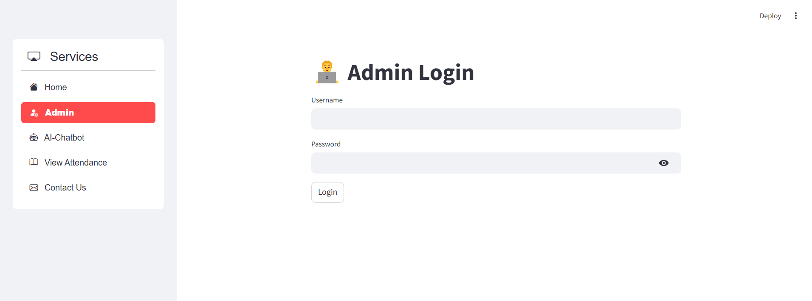
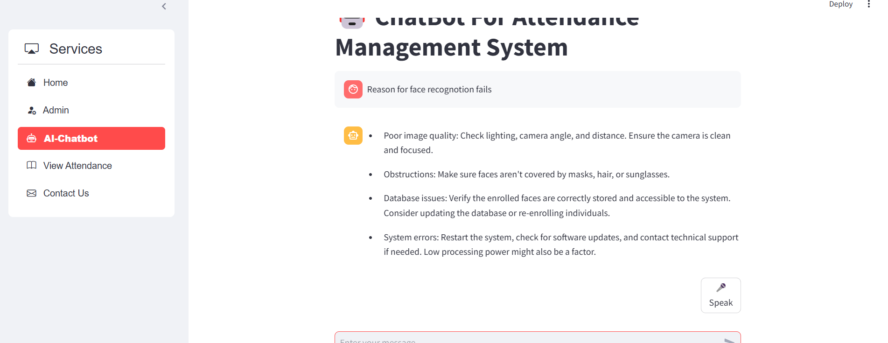
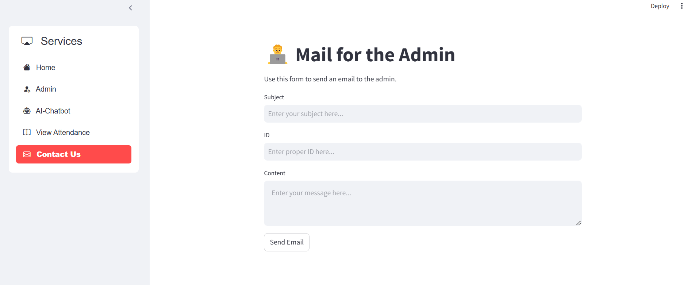

# 🚀 Anti-Spoof Smart Attendance System

## 🔍 Project Overview

The **Anti-Spoof Smart Attendance System** is an intelligent, AI-powered solution built to revolutionize the way attendance is tracked in educational and corporate environments. By leveraging facial recognition technology and integrating anti-spoofing mechanisms, the system ensures **secure**, **contactless**, and **fraud-resistant** attendance logging.

In addition to its core functions, the system features a built-in **AI Chatbot** designed to answer user queries, provide technical assistance, and offer helpdesk-like support—all without human intervention. This makes it not just a tool for attendance, but a **complete smart assistant** for user interaction and system guidance.

---

## 🧠 Key Features

- ✅ **Real-Time AI Face Recognition**  
  Powered by `DeepFace` and `dlib` for accurate and fast facial verification against stored profiles.

- 🧪 **Liveness Detection & Anti-Spoofing**  
  Advanced spoof prevention through facial landmark analysis and motion verification to reject fake inputs (e.g., photos, videos).

- 🔊 **Voice Feedback System**  
  Uses `pyttsx3` for audio confirmation, ensuring a seamless and interactive user experience.

- 📧 **Automated Email Attendance Reports**  
  Sends secure, time-stamped logs to designated administrators via email using `smtplib`.

- 🤖 **AI Chatbot Support**  
  Built-in intelligent chatbot trained to respond to user queries, usage instructions, and troubleshooting—making the system more accessible and user-friendly.

- 🗃️ **Database-Driven Logging**  
  Utilizes `SQLite` to maintain attendance logs, timestamps, and user profile data securely and efficiently.

---

## 🛠️ Technologies Used

- **Languages & Frameworks:** Python  
- **Libraries & Tools:** DeepFace, OpenCV, Dlib, pyttsx3, SQLite, smtplib, PIL, NumPy  
- **AI Module:** Custom AI chatbot (NLU-based query handling)  
- **Others:** datetime, os, and standard Python utilities
---
## 📁 Project Modules

```plaintext
Anti-Spoof-Smart-Attendance-System/
│
├── main.py                        # Launches the system
├── recognition.py                # Face recognition + liveness detection
├── deepface_identificatiom.py    # DeepFace model handler
├── database_management.py        # SQLite database interaction
├── Mail_for_attendance.py        # Email attendance report
├── dataset_creation_dlib.py      # User face dataset creation
├── text_to_speech.py             # Voice feedback module
├── shape_predictor_68_face_landmarks.dat  # Facial landmarks data
└── .git/                         # Git version control files
```
## 📷 Screenshots

### 📌 Admin Page


### 📌 ChatBot


### 📌 Student Attendance Checker


### 📌 Admin Mailing



## 🌍 Real-World Applications

- 🎓 **Educational Institutions** – Automate student attendance securely and efficiently.
- 🏢 **Corporate Offices** – Monitor employee attendance and manage secure access logs.
- 🏥 **Healthcare Facilities** – Enable hands-free, contactless attendance in sterile environments.
- 🔐 **Government & Defense** – Implement secure and tamper-proof identity verification in high-risk zones.

---

## 📈 Future Improvements (Optional Add-ons)

- 🌐 Web-based UI for admin monitoring
- ☁️ Cloud database and REST API integration
- 😷 Facial mask detection module
- 📊 Attendance analytics dashboard with insights

---

## 🧑‍💻 About the Developer

_This project was built as part of my engineering learning journey to explore computer vision, AI integration, and real-time system design. It reflects my passion for building smart, secure, and scalable solutions that solve real problems._ 🚀
